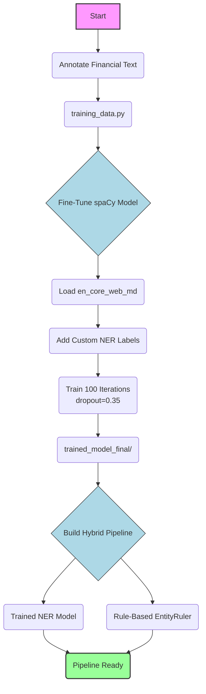
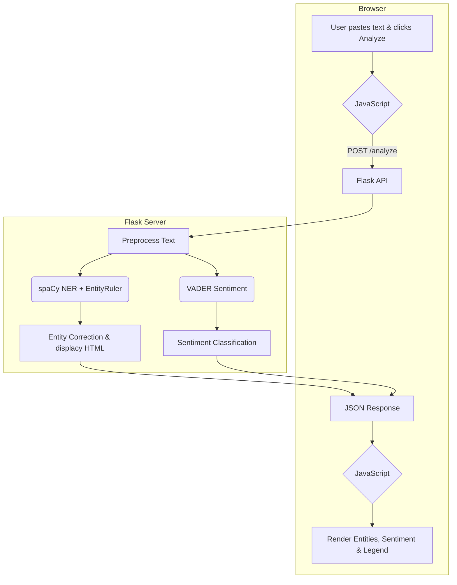

# FinSight: NLP Financial Analysis App


A web application that performs NLP on financial text using a **custom fine-tuned spaCy model** for Named Entity Recognition and **VADER** for sentiment analysis. Demonstrates a full NLP workflow — from data annotation and model training to a hybrid pipeline (trained + rule-based) served via a Flask API.

## Key Features

- **Custom NER:** Identifies `STOCK` tickers and `FIN_EVENT` (e.g., "dot-com crash") alongside standard entities like `PERSON`, `ORG`, and `GPE`.
- **Hybrid NLP Pipeline:** Combines a fine-tuned spaCy model with a rule-based `EntityRuler` for robust entity detection.
- **Sentiment Analysis:** Classifies text as Positive, Negative, or Neutral using VADER compound scores.
- **Color-Coded Visualization:** Renders entities with displacy and a dynamic legend.
- **Interactive UI:** Dark-themed web interface for pasting text and viewing results.

## How It Works

### Training Pipeline


```mermaid
graph TD
    A[Start] --> B(Annotate Financial Text)
    B --> C(training_data.py)
    C --> D{Fine-Tune spaCy Model}
    D --> D1(Load en_core_web_md)
    D1 --> D2(Add Custom NER Labels)
    D2 --> D3("Train 100 Iterations<br/>dropout=0.35")
    D3 --> E(trained_model_final/)
    E --> F{Build Hybrid Pipeline}
    F --> F1(Trained NER Model)
    F --> F2(Rule-Based EntityRuler)
    F1 --> G(Pipeline Ready)
    F2 --> G

    style A fill:#f9f,stroke:#333,stroke-width:2px
    style G fill:#9f9,stroke:#333,stroke-width:2px
    style D fill:#add8e6,stroke:#333,stroke-width:1px
    style F fill:#add8e6,stroke:#333,stroke-width:1px
```

### Request Flow


```mermaid
graph TD
    subgraph "Browser"
        A["User pastes text & clicks Analyze"] --> B{JavaScript}
        B -- "POST /analyze" --> C[Flask API]
        F[JSON Response] --> G{JavaScript}
        G --> H[Render Entities, Sentiment & Legend]
    end

    subgraph "Flask Server"
        C --> D[Preprocess Text]
        D --> E1("spaCy NER + EntityRuler")
        D --> E2("VADER Sentiment")
        E1 --> I[Entity Correction & displacy HTML]
        E2 --> J[Sentiment Classification]
        I --> F
        J --> F
    end
```

## Project Structure

```
finsight-nlp-app/
├── app.py                  # Flask app factory with routes
├── config.py               # Environment-based configuration
├── nlp/
│   ├── pipeline.py         # Model loading, NER, sentiment analysis
│   └── preprocessing.py    # Text cleaning utilities
├── training/
│   ├── train.py            # spaCy model fine-tuning script
│   └── training_data.py    # Annotated training examples
├── templates/
│   └── index.html          # Frontend UI
├── tests/
│   ├── conftest.py         # Test fixtures with mocked NLP pipeline
│   ├── test_app.py         # Route/endpoint tests
│   └── test_pipeline.py    # NLP logic unit tests
├── Dockerfile
├── docker-compose.yml
├── .github/workflows/ci.yml
├── requirements.txt
└── requirements-dev.txt
```

## Quick Start

### With Docker

```bash
docker compose up --build
```

Open `http://localhost:5000`.

### Manual Setup

```bash
git clone https://github.com/LordAizen1/finsight-nlp-app.git
cd finsight-nlp-app

python -m venv venv
source venv/bin/activate        # Windows: venv\Scripts\Activate

pip install -r requirements.txt
python -m spacy download en_core_web_md
python training/train.py
python app.py
```

Open `http://127.0.0.1:5000`.

## API Endpoints

| Method | Endpoint   | Description                          |
|--------|------------|--------------------------------------|
| GET    | `/`        | Serves the web UI                    |
| GET    | `/health`  | Health check                         |
| POST   | `/analyze` | Analyze text for entities & sentiment|

**POST `/analyze`** example:
```json
// Request
{"text": "AAPL surged 5% after the 2008 financial crisis ended."}

// Response
{
  "html": "<div>...highlighted entities...</div>",
  "legend": {"STOCK": {"description": "...", "color": "#ffb3c1"}},
  "sentiment_score": 0.296,
  "sentiment_label": "Positive"
}
```

## Running Tests

```bash
pip install -r requirements-dev.txt
pytest tests/
```

## Technologies

- **Backend:** Python, Flask, Gunicorn
- **NLP:** spaCy (fine-tuned NER), VADER Sentiment
- **Testing:** pytest
- **Deployment:** Docker, Render, GitHub Actions CI
