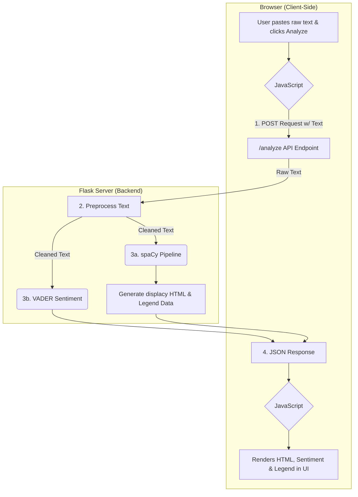

# FinSight: NLP Financial Analysis App

This is a web application that performs Natural Language Processing on financial text. It uses a custom-fine-tuned spaCy model to perform Named Entity Recognition (NER) and the VADER library for sentiment analysis. The project demonstrates a full NLP workflow from data annotation and model training to building a hybrid model (trained + rule-based) and serving it via a Flask API.

### Key Features

- **Custom Named Entity Recognition:** Identifies custom entities like `STOCK` tickers and `FIN_EVENT` (e.g., "dot-com crash") in addition to standard entities like `PERSON` and `ORG`.
- **Sentiment Analysis:** Provides a Positive, Negative, or Neutral sentiment score for the input text using the VADER model.
- **Interactive UI:** A clean, dark-themed web interface for pasting text and viewing results.
- **Color-Coded Visualization:** Displays the analyzed text with entities highlighted in color.
- **Dynamic Legend:** Automatically generates a legend explaining the entity labels found in the text.
- **Hybrid NLP Pipeline:** The final model loads a custom-trained spaCy pipeline and then adds a rule-based `EntityRuler` on top to create a robust, hybrid system.

### How It Works

This diagram shows the flow of data from the user's browser to the Flask backend and back.



### Technologies Used

- **Backend:** Python, Flask, spaCy, VADER Sentiment
- **Frontend:** HTML, CSS, JavaScript (with Fetch API)
- **NLP Concepts:** Fine-tuning, Data Annotation, EntityRuler, Dependency Parsing, Catastrophic Forgetting, Overgeneralization.

---

## Setup and Usage

To run this project locally, follow these steps:

1.  **Clone the repository:**
    ```bash
    git clone <your-repo-url>
    cd finsight-nlp-app
    ```

2.  **Create a virtual environment:**
    ```bash
    python -m venv venv
    source venv/bin/activate  # On Windows, use `venv\Scripts\activate`
    ```

3.  **Install dependencies:**
    ```bash
    pip install -r requirements.txt
    python -m spacy download en_core_web_md
    ```

4.  **Train the model:**
    The core of this project is the custom-trained model. Run the training script to generate the `trained_model_final` directory:
    ```bash
    python train.py
    ```

5.  **Run the Flask application:**
    ```bash
    python app.py
    ```

6.  Open your browser and navigate to `http://127.0.0.1:5000`.

---

## Project Status & Future Improvements

This project serves as a strong proof-of-concept and a demonstration of a full NLP workflow. The entity recognition model is custom-trained and performs well on the specific financial texts it was trained on.

However, the sentiment analysis component currently uses **VADER**, which is a simple, rule-based "bag-of-words" model. As we discovered, it is not powerful enough to understand the deep context of financial news and can misinterpret cautionary articles as "Positive".

### FinSight v2: The Path Forward

The clear next step for this project is to replace the VADER model with a state-of-the-art, context-aware Transformer model like **FinBERT**. FinBERT is specifically pre-trained on financial documents and would provide a much more nuanced and accurate sentiment analysis, correctly interpreting the tone of complex financial news.

The current application provides the perfect foundation for this upgrade, as it already handles the text cleaning and sentence extraction that would be required before feeding data to FinBERT.